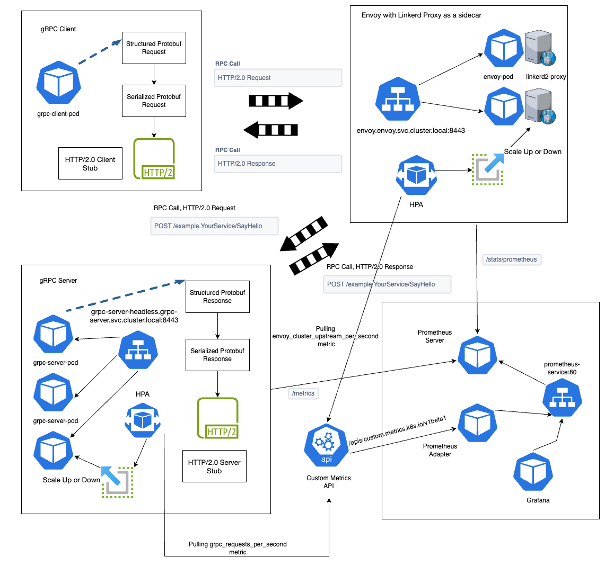
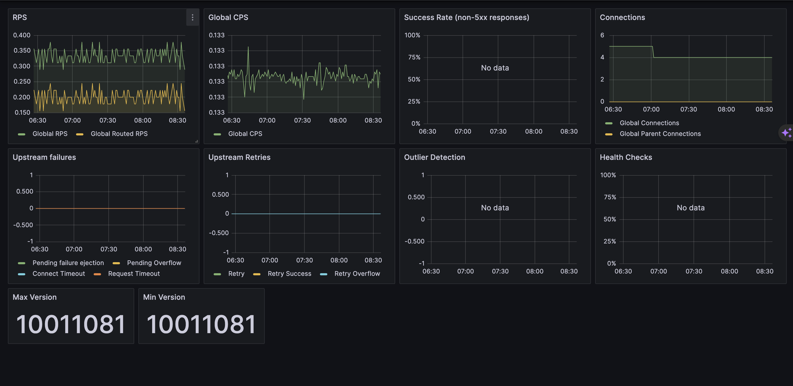
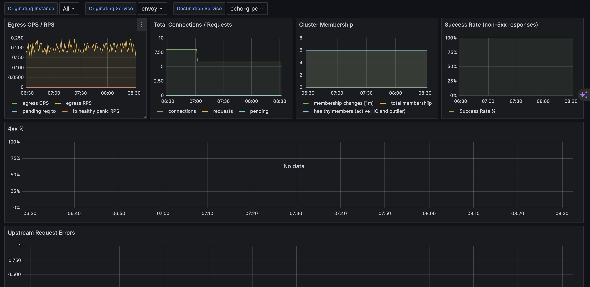
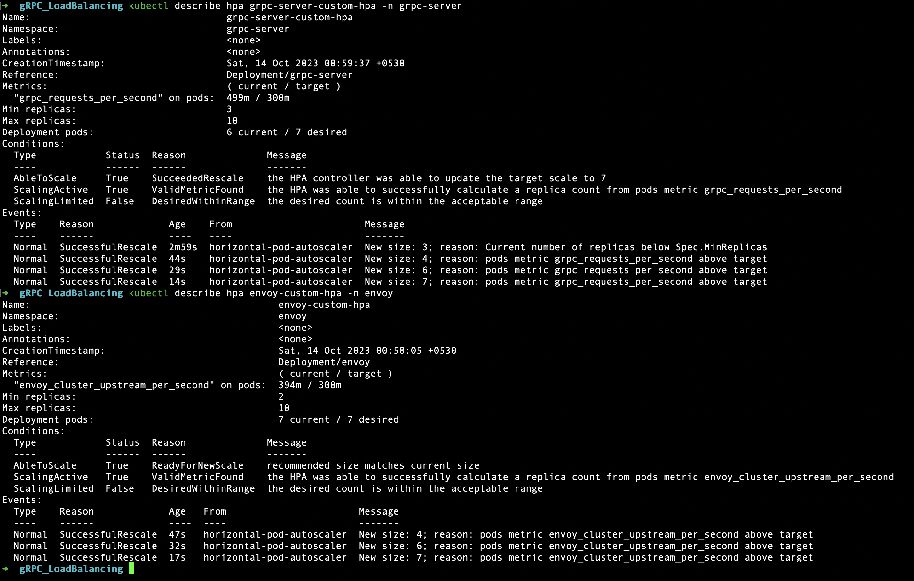
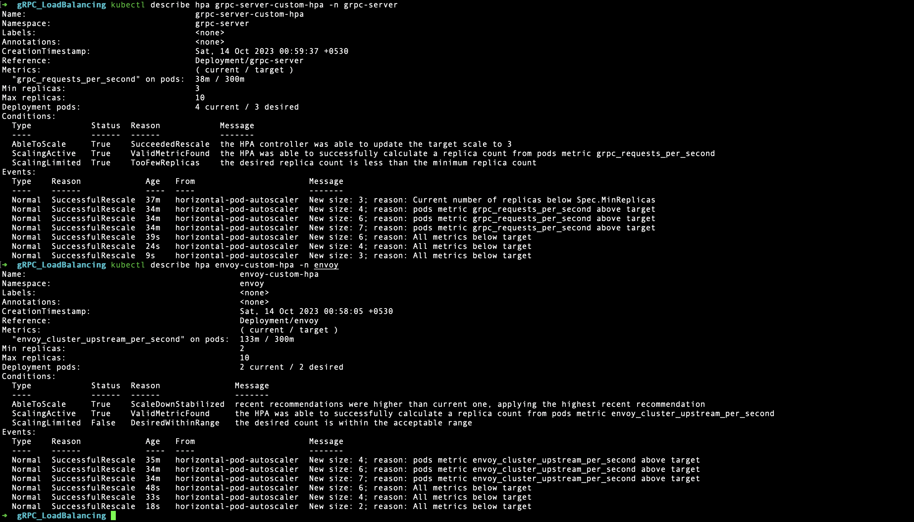
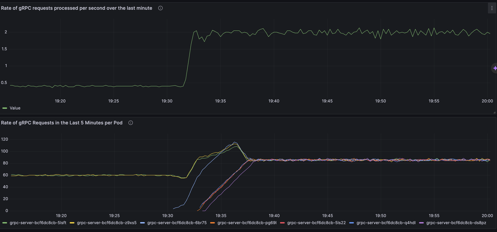
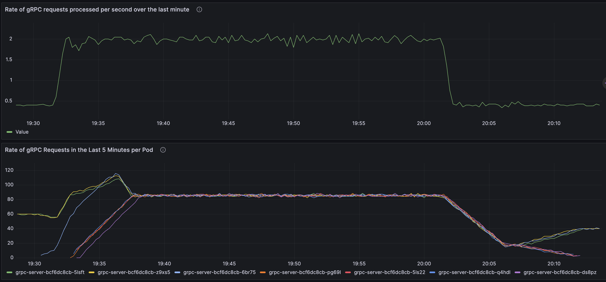
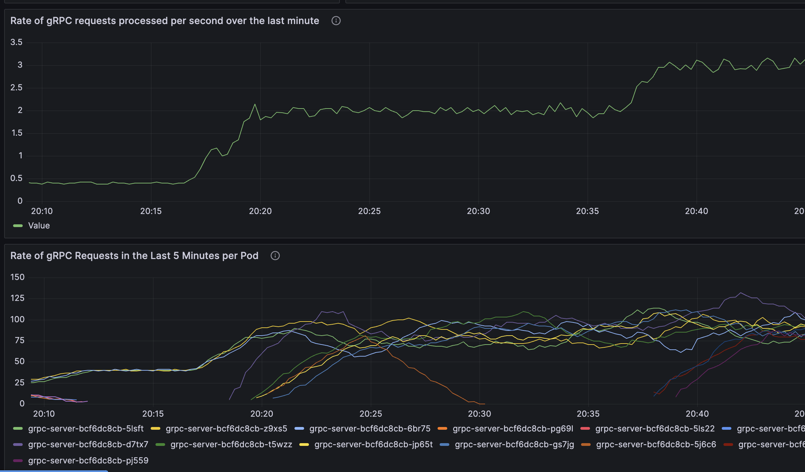

Load Balancing in gRPC
======================

<!-- PROJECT LOGO -->
<br />
<div align="center">
    
</div>

<!-- TABLE OF CONTENTS -->
<details>
  <summary>Table of Contents</summary>
  <ol>
    <li>
      <a href="#scope">Scope</a>
    </li>
    <li>
      <a href="#background">Background</a>
    </li>
    <li>
        <a href="#architecture">Architecture</a>
        <ul>
            <li><a href="#overview">Overview</a></li>
            <li><a href="#why-envoy">Why Envoy?</a></li>
            <li><a href="#why-headless-service">Why Headless Service?</a></li>
            <li><a href="#workflow">Workflow</a></li>
        </ul>
    </li>
    <li>
        <a href="#local-dev-setup">Local Dev Setup</a>
         <ul>
            <li><a href="#prerequisite">Prerequisite</a></li>
            <li><a href="#installation">Installation</a></li>
        </ul>
    </li>
    <li>
        <a href="#troubleshooting-and-monitoring">Troubleshooting and Monitoring</a>
        <ul>
            <li>
                <a href="#a-word-on-the-load-balancing-algorithms">A word on the load balancing algorithms</a>
            </li>
        </ul>
    </li>
  </ol>
</details>
====================================================================================

# Scope

This repository addresses the challenges and complexities of implementing efficient gRPC load balancing within a Kubernetes cluster. The goal is to ensure optimal distribution of traffic across gRPC-based services to achieve high availability, scalability, and performance.

# Background

Load-balancing within gRPC happens on a per-call basis, not a per-connection basis.  In other words, even if all requests come from a single client, we still want them to be load-balanced across all servers.

# Architecture

## Overview

The communication flow from a gRPC client through Linkerd Proxy, which acts as a service mesh, to an Envoy proxy serving as a load balancer, and finally, to a gRPC server. This setup ensures efficient, reliable, and secure communication between our client and server.

- gRPC Client: Our gRPC client initiates communication. This could be any application or service that wants to interact with our gRPC server.

- Linkerd Proxy (Service Mesh): Linkerd is used as a service mesh to facilitate advanced networking capabilities such as load balancing, service discovery, and security. When the client sends a request, Linkerd acts as an intermediary.

- Envoy as a Load Balancer: Within the Linkerd service mesh, Envoy proxies are deployed to handle routing and load balancing. Envoy ensures that incoming requests are distributed to available gRPC server instances effectively, optimizing resource usage and by using a headless service.

- gRPC Server: The gRPC server is the final destination for the client's request. It processes the request, executes business logic, and sends a response back to the client through the same flow, ensuring a seamless and efficient communication process.

This flow enables us to manage our gRPC communication more efficiently, providing benefits such as load balancing, failover, and transparent service discovery, all while securing our communication within a service mesh. It's a powerful architecture that enhances the reliability and performance of our gRPC-based applications.

## Why Envoy?

We needed a layer 7 (L7) load balancer because they operate at the application layer and can inspect traffic in order to make routing decisions. Most importantly, they can support the HTTP/2 protocol.

I chose Envoy (A smarter load balancer) as a load balancer proxy for below mentioned reasons.

- A proxy server created by Lyft using C++ as a language to achieve high performance.
- It has built-in support for a service discovery technique it calls STRICT_DNS, which builds on querying a DNS record, and expecting seeing an A record with an IP address for every node of the upstream cluster. This made it easy to use with a headless service in Kubernetes.
- It supports various load balancing algorithms, among others “Least Request”.

There are a number of LB policies provided with envoy. The most notable ones are ROUND_ROBIN (the default), and LEAST_REQUEST.

## Why Headless Service?

Each connection to the service is forwarded to one randomly selected backing pod. But what if the client needs to connect to all of those pods? What if the backing pods themselves need to each connect to all the other backing pods. Connecting through the service clearly isn’t the way to do this. What is?

For a client to connect to all pods, it needs to figure out the the IP of each individual pod. One option is to have the client call the Kubernetes API server and get the list of pods and their IP addresses through an API call, but because you should always strive to keep your apps Kubernetes-agnostic, using the API server isn’t ideal

Luckily, Kubernetes allows clients to discover pod IPs through DNS lookups. Usually, when you perform a DNS lookup for a service, the DNS server returns a single IP — the service’s cluster IP. But if you tell Kubernetes you don’t need a cluster IP for your service (you do this by setting the clusterIP field to None in the service specification ), the DNS server will return the pod IPs instead of the single service IP. Instead of returning a single DNS A record, the DNS server will return multiple A records for the service, each pointing to the IP of an individual pod backing the service at that moment. Clients can therefore do a simple DNS A record lookup and get the IPs of all the pods that are part of the service. The client can then use that information to connect to one, many, or all of them.

## Workflow

<div align="center">
    <h3 align="center">Architectural Diagram</h3>
    
</div>

# Local Dev Setup

## Prerequisite

- Docker: Install Docker on your local machine. Docker will be used for building and managing container images for your gRPC client, server, and other services.

- minikube or Kubernetes Cluster: Set up either minikube for a local Kubernetes cluster or use an existing Kubernetes cluster for testing and deploying your applications.

- Basic Knowledge of Kubernetes Components: Gain a fundamental understanding of essential Kubernetes components like Pods, Services, Deployments, ConfigMaps, Secrets, and Ingress. Knowledge of these components is crucial for deploying and managing your applications in a Kubernetes environment.

- Custom Metric APIService: Have prior knowledge of how to configure and work with Custom Metric APIServices in Kubernetes. You should understand how to define, collect, and utilize custom metrics specific to your gRPC applications.

- Good Understanding of Horizontal Pod Autoscaling (HPA): Be familiar with Horizontal Pod Autoscaling in Kubernetes. Understand how to define HPA rules based on custom metrics and how to automatically scale the number of application pods up or down in response to changes in resource demands.

## Installation

Below is an example how you can construct your own gRPC server and client using Protobuf and containerzie your applications using docker images, then deploy them on a k8s cluster to test and achieve high availability, scalability, and performance. Also we will see, how we can build monitoring and observability on top of it.

- Clone the repo
   ```sh
   git clone https://github.com/ujala-singh/gRPC_LoadBalancing_K8s.git
   ```

- I have stored the source code files for gRPC server and client in the directory ```grpc_server_client_setup``` along with the docker files. In this step, we will build the Docker images.
    ```sh
   cd grpc_server_client_setup
   docker build -t jolly3/grpc-server-image -f Dockerfile.server .
   docker build -t jolly3/grpc-server-image -f Dockerfile.client .
   ```
    You can checkout these images on dockerhub as well:
    * [gRPC Server Image](https://hub.docker.com/r/jolly3/grpc-server/tags)
    * [gRPC Client Image](https://hub.docker.com/r/jolly3/grpc-client/tags)

- Since, I have used minikube to deploy all of my resources. I will mention the steps for the same.
    ```sh
   minikube start
   ```
   Now along with this, we will install the Linkerd.
   ```sh
   curl --proto '=https' --tlsv1.2 -sSfL https://run.linkerd.io/install | sh
   ```
   Make sure you add the linkerd CLI to your path with:
   ```sh
   export PATH=$PATH:/Users/nehapatel/.linkerd2/bin
   ```
   ```sh
   linkerd check --pre   # validate that Linkerd can be installed
   ```
   ```sh
   linkerd install --crds | kubectl apply -f -   # install the Linkerd CRDs
   ```
   ```sh
   linkerd install --set proxyInit.runAsRoot=true | kubectl apply -f -   # install the control plane into the 'linkerd' namespace
   ```
   ```sh
   linkerd viz install | kubectl apply -f -   # install the on-cluster metrics stack
   ```
   ```sh
   linkerd check     # validate everything worked!
   ```

- I have written a shell script which will provision all of the resources in the respective namespaces.
    ```sh
   bash deploy-all.sh
   ```

- We will inject envoy deployment with the linkerd proxy to achieve better performance and load balancing across envoy pods.
    ```sh
    linkerd inject envoy_proxy_k8s/envoy-deployment.yaml | kubectl apply -f -
    ```
- Installing Prometheus Adapter: The Custom Metric API in Kubernetes is required if HPA is implemented based on custom metrics. Currently, most users use the Prometheus Adapter to provide the Custom Metric API. The Prometheus Adapter converts the received custom metric APIs to Prometheus requests and returns data queried from Prometheus to the Custom Metric API Server.

    ```sh
    helm repo add prometheus-community https://prometheus-community.github.io/helm-charts
    helm repo update
    ```

    ```sh
    helm install prometheus-adapter prometheus-community/prometheus-adapter --values prometheus_k8s/prometheus-adapter-values.yaml --namespace prometheus
    ```

- After the installation is complete, run the following command to query all custom metrics:

    ```sh
    kubectl get --raw "/apis/custom.metrics.k8s.io/v1beta1" | jq .
    ```

    ```sh
    kubectl get --raw "/apis/custom.metrics.k8s.io/v1beta1/namespaces/grpc-server/pods/*/grpc_requests_per_second" | jq .
    ```

    ```sh
    kubectl get --raw "/apis/custom.metrics.k8s.io/v1beta1/namespaces/envoy/pods/*/envoy_cluster_upstream_per_second" | jq .
    ```

- Once we start getting the above custom metrics ```grpc_requests_per_second``` and ```envoy_cluster_upstream_per_second```, we can configure the HPAs for the envoy and gRPC server deployments.

    ```sh
    kubectl apply -f envoy_proxy_k8s/envoy-hpa.yaml
    ```

    ```sh
    kubectl apply -f grpc_server_k8s/grpc-server-hpa.yaml
    ```

- Now we can port-forward the grafana pod on port 3000 and visulaize the metrics in the dashboards.

    ```sh
    kubectl port-forward <grafana-pod-name> 3000 -n grafana
    ```

# Troubleshooting and Monitoring
One way to do monitoring is to use Prometheus to scrape the stats from the proxy pods. Envoy has built-in support for this, the Prometheus stats are published on the admin port at the route /stats/prometheus.

For troubleshooting purposes, I have also enabled logging into my gRPC server and client. Some sample logs are given below:
## Server Logs
```sh
2023-10-14 15:09:45,053 - __main__ - INFO - Starting server. Listening on port 50051.
2023-10-14 15:10:29,687 - __main__ - INFO - Received a request from grpc-client-654d8cbf7f-ql96c: Ujala
2023-10-14 15:10:34,697 - __main__ - INFO - Received a request from grpc-client-654d8cbf7f-ql96c: Ujala
2023-10-14 15:10:54,758 - __main__ - INFO - Received a request from grpc-client-654d8cbf7f-ql96c: Ujala
2023-10-14 15:11:04,784 - __main__ - INFO - Received a request from grpc-client-654d8cbf7f-ql96c: Ujala
```
## Client Logs
```sh
2023-10-14 15:10:24,672 - __main__ - INFO - Received: Hello, Ujala! This message is from grpc-server-bcf6dc8cb-fzllg
2023-10-14 15:10:29,690 - __main__ - INFO - Received: Hello, Ujala! This message is from grpc-server-bcf6dc8cb-f7mpn
2023-10-14 15:10:34,699 - __main__ - INFO - Received: Hello, Ujala! This message is from grpc-server-bcf6dc8cb-f7mpn
2023-10-14 15:10:39,709 - __main__ - INFO - Received: Hello, Ujala! This message is from grpc-server-bcf6dc8cb-fzllg
2023-10-14 15:10:44,734 - __main__ - INFO - Received: Hello, Ujala! This message is from grpc-server-bcf6dc8cb-fzllg
2023-10-14 15:10:49,749 - __main__ - INFO - Received: Hello, Ujala! This message is from grpc-server-bcf6dc8cb-fzllg
2023-10-14 15:10:54,759 - __main__ - INFO - Received: Hello, Ujala! This message is from grpc-server-bcf6dc8cb-f7mpn
2023-10-14 15:10:59,775 - __main__ - INFO - Received: Hello, Ujala! This message is from grpc-server-bcf6dc8cb-fzllg
2023-10-14 15:11:04,786 - __main__ - INFO - Received: Hello, Ujala! This message is from grpc-server-bcf6dc8cb-f7mpn
2023-10-14 15:11:09,803 - __main__ - INFO - Received: Hello, Ujala! This message is from grpc-server-bcf6dc8cb-fzllg
2023-10-14 15:11:14,822 - __main__ - INFO - Received: Hello, Ujala! This message is from grpc-server-bcf6dc8cb-f7mpn
2023-10-14 15:11:19,849 - __main__ - INFO - Received: Hello, Ujala! This message is from grpc-server-bcf6dc8cb-fzllg
```

<div align="center">
    <h3 align="center">Envoy Global Stats</h3>
    
</div>

<div align="center">
    <h3 align="center">Envoy Service to Service Stats</h3>
    
</div>

## A word on the load balancing algorithms
In our exploration of load balancing mechanisms within our Kubernetes environment, we delved into leveraging Envoy as a critical intermediary layer. Employing the ROUND_ROBIN strategy, we observed highly promising results as it efficiently distributed the load across the various pods of our server. This effectiveness is readily demonstrable through the metric graphs we've collected. However, it became evident that traditional Kubernetes connection-based load balancing didn't align with the specific requirements of gRPC. Given that gRPC operates atop the HTTP/2 protocol, which relies on multiplexing and stream-based communication, Kubernetes' standard load balancing was less than optimal. This strategic move was driven by the need for a more compatible and efficient solution to address the unique characteristics of gRPC communication, ensuring seamless and performant interactions within our Kubernetes cluster.

<div align="center">
    <h3 align="center">HPA Autoscale Up</h3>
    
</div>

<div align="center">
    <h3 align="center">HPA Autoscale Down</h3>
    
</div>

<div align="center">
    <h3 align="center">gRPC LoadBalancing Up</h3>
    
</div>

<div align="center">
    <h3 align="center">gRPC LoadBalancing Down</h3>
    
</div>

<div align="center">
    <h3 align="center">gRPC Without LoadBalancing</h3>
    
</div>
